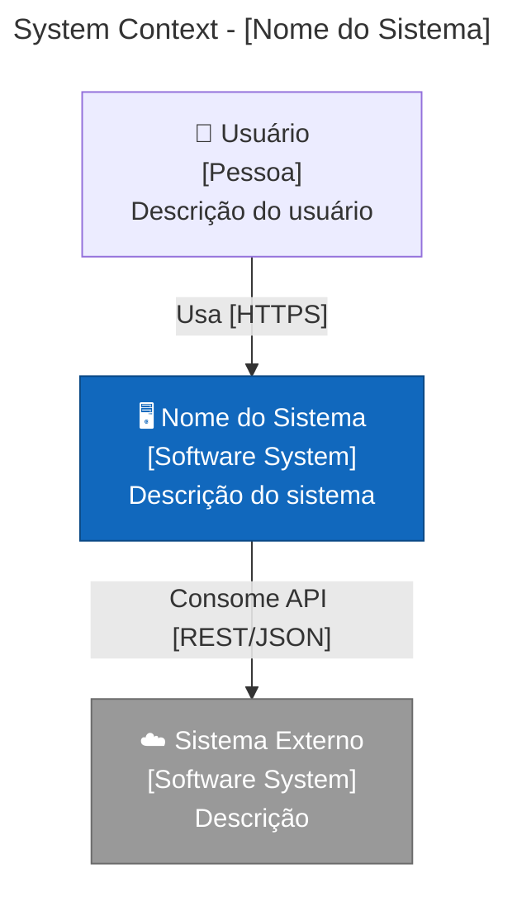
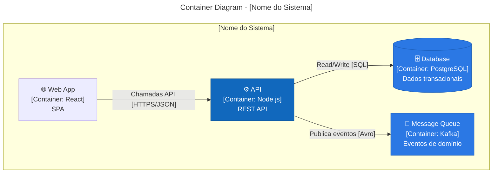

# Arquiteto de Soluções — Playbooks Operacionais

## Triagem (2 min)

Checklist universal (para decisões de arquitetura e revisões de design):
1. Quais são os architecture characteristics (-ilities) prioritários para ESTE sistema?
2. Quais são as constraints (tempo, equipe, budget, regulação, legado)?
3. Onde estão os dados e quem é o owner?
4. Qual o blast radius se este componente falhar?
5. Existe ADR documentando esta decisão? Se não, crie antes de implementar.
6. Há fitness function protegendo as -ilities críticas?
7. O diagrama C4 está atualizado no nível adequado?

Risco e postura:
- **Baixo**: decisão reversível, blast radius pequeno, sem impacto em dados/segurança. Postura: decide e documenta ADR leve.
- **Médio**: decisão com impacto moderado em integração ou performance. Postura: ADR completo + PoC/spike + revisão com stakeholders.
- **Alto**: decisão estrutural (decomposição, data model, segurança, compliance). Postura: ADR formal + avaliação com matriz + fitness functions + threat model se aplicável.

## Playbooks

### Design de sistema do zero
Quando usar: novo produto, novo serviço, nova plataforma, greenfield.
Objetivo: produzir arquitetura documentada, validada por trade-offs, com fitness functions.
Entradas mín.: requisitos funcionais, stakeholders, constraints (tempo/equipe/budget), -ilities prioritárias.
Passos:
1. Elicitar e priorizar architecture characteristics (-ilities) com stakeholders
2. Identificar bounded contexts via event storming ou domain storytelling
3. Definir estilo arquitetural (monolito modular / microservices / serverless / hybrid) com base em -ilities e constraints
4. Projetar 2-3 alternativas com trade-offs explícitos por -ility
5. Aplicar matriz de decisão e recomendar com justificativa
6. Criar diagramas C4 (Context + Container no mínimo)
7. Definir fitness functions para as -ilities críticas
8. Documentar como ADR
9. Validar com revisão de pares (tech lead, backend, devops)
Saídas: ADR aprovado, diagramas C4, fitness functions, backlog de spikes (se necessário).
QA checklist: -ilities mapeadas; trade-offs explícitos; ADR completo; diagrama atualizado; fitness functions definidas.
Erros comuns: pular elicitação de -ilities; escolher tech antes do problema; design sem constraints reais.
Alertas: se requisitos mudam significativamente, revisitar ADR e fitness functions.
Escalonar: se envolve compliance/regulação; se budget não suporta a arquitetura proposta.

### Avaliação de tecnologia
Quando usar: adotar novo framework/linguagem/serviço/plataforma; substituir componente existente.
Objetivo: decisão baseada em evidência com fitness functions e PoC.
Entradas mín.: problema a resolver, -ilities afetadas, opções candidatas, constraints (equipe, custo, compliance).
Passos:
1. Definir critérios de avaliação alinhados às -ilities do sistema
2. Pesquisar opções (mín. 3): build vs buy vs open source
3. Preencher matriz de decisão com pesos e scores (1-5)
4. PoC time-boxed (1-2 sprints) para top 2 opções, focando nos riscos maiores
5. Definir fitness functions para validar a escolha em produção
6. Documentar como ADR com evidências do PoC
Saídas: ADR com matriz, resultados de PoC, fitness functions, plano de adoção.
QA checklist: critérios definidos antes da avaliação; PoC focou nos riscos; custo total de ownership considerado.
Erros comuns: avaliar só pelo "hello world"; ignorar custo operacional; não considerar exit strategy.
Alertas: lock-in sem exit strategy documentada.
Escalonar: se envolve mudança de linguagem/plataforma core; se custo > threshold definido.

### Migração monolito → serviços
Quando usar: monolito com deploy lento, coupling alto, times esperando uns pelos outros.
Objetivo: extrair serviços incrementalmente sem big bang, preservando funcionalidade.
Entradas mín.: mapa de domínios/bounded contexts, dependências, métricas de deploy/lead time, fitness functions existentes.
Passos:
1. Mapear bounded contexts dentro do monolito (event storming / dependency analysis)
2. Identificar "seam" mais desacoplado e de maior valor (alto churn + baixo coupling)
3. Aplicar Strangler Fig pattern: nova funcionalidade no serviço novo, redirecionar gradualmente
4. Criar anti-corruption layer para isolar modelo do monolito
5. Migrar dados do bounded context (dual-write → switch reads → decommission)
6. Definir contratos (API/eventos) entre serviço e monolito
7. Fitness functions: deploy independence, latência ponta-a-ponta, error rate
8. Repetir para o próximo contexto (um por vez)
Saídas: serviço extraído, ADR, contratos definidos, fitness functions, plano do próximo.
QA checklist: funcionalidade preservada; latência aceitável; rollback possível; dados consistentes.
Erros comuns: extrair tudo ao mesmo tempo; ignorar shared database; não definir contratos.
Alertas: se extrair cria distributed monolith (sync calls em cadeia), reconsiderar granularidade.
Escalonar: se migração de dados é complexa (DBA); se envolve mudança de contratos externos.

### Design de API (REST/GraphQL/gRPC)
Quando usar: nova API, redesign de API existente, integração entre serviços/times.
Objetivo: contrato claro, versionado, governado, que evolui sem quebrar consumidores.
Entradas mín.: consumidores, casos de uso, -ilities (latência, throughput, compatibilidade), constraints.
Passos:
1. Contract-first: defina o contrato (OpenAPI/GraphQL schema/protobuf) antes da implementação
2. Escolha o estilo: REST para CRUD/público; GraphQL para BFF/agregação; gRPC para service-to-service de alta performance
3. Defina versionamento: URL path (/v1/) para REST; schema evolution para GraphQL/gRPC
4. Defina governance: quem aprova mudanças, breaking change policy, deprecation timeline
5. Documente error handling, pagination, rate limiting, autenticação/autorização
6. Crie testes de contrato (consumer-driven quando múltiplos consumidores)
7. Publique spec e changelog; monitore adoção por versão
Saídas: spec publicada, testes de contrato, governance definida, ADR.
QA checklist: backward compatibility validada; testes de contrato; error responses padronizadas; rate limits.
Erros comuns: implementar antes do contrato; breaking change sem deprecation; não monitorar adoção.
Alertas: se API é pública/parceiros, exigir governance formal e deprecation policy.
Escalonar: se envolve parceiros externos; se compliance exige auditoria de API.

### Arquitetura event-driven
Quando usar: desacoplamento entre domínios, processamento assíncrono, reatividade a mudanças de estado.
Objetivo: sistema baseado em eventos com consistência, rastreabilidade e resiliência.
Entradas mín.: domínios envolvidos, fluxos de negócio, requisitos de consistência, throughput esperado.
Passos:
1. Event storming: mapear domain events, commands, aggregates, bounded contexts
2. Classificar eventos: notification, event-carried state transfer, event sourcing
3. Definir topologia: broker (pub/sub) vs mediator (orquestração) vs event mesh
4. Projetar sagas para transações distribuídas: choreography vs orchestration
5. Definir schema registry e versionamento de eventos
6. Projetar CQRS se leitura e escrita têm requisitos divergentes
7. Definir DLQ, idempotência, reprocessamento e ordering guarantees
8. Fitness functions: consumer lag, latência end-to-end, error rate, ordering violations
Saídas: mapa de eventos, topologia, contratos de eventos, ADR, fitness functions.
QA checklist: idempotência; DLQ operável; schema versionado; ordering preservada onde necessário.
Erros comuns: event soup (eventos sem semântica clara); ignorar ordering; exactly-once como premissa.
Alertas: event mesh adiciona roteamento inteligente mas complexidade operacional; justifique antes de adotar.
Escalonar: se envolve consistência financeira; se throughput > capacity planejada.

### Revisão de escalabilidade
Quando usar: preparação para crescimento, degradação sob carga, planejamento de capacidade.
Objetivo: identificar bottlenecks, definir estratégias de escala, validar com load model.
Entradas mín.: métricas atuais (throughput, latência, utilização), projeção de crescimento, SLOs, arquitetura atual.
Passos:
1. Modelar carga: padrões de tráfego (pico, média, burst), crescimento projetado
2. Identificar bottlenecks: CPU, memória, IO, rede, banco, filas, dependências externas
3. Classificar escalabilidade: horizontal (stateless) vs vertical (stateful/DB)
4. Avaliar particionamento: sharding, multi-tenancy, cell-based architecture
5. Projetar caching strategy: read-through, write-behind, cache-aside + invalidação
6. Definir backpressure e load shedding para degradação graceful
7. Load test: validar com carga 2-3x do pico projetado
8. Fitness functions: throughput, p95/p99, error rate sob carga, custo por request
Saídas: load model, bottleneck analysis, plano de escala, ADR, fitness functions.
QA checklist: load test executado; bottlenecks documentados; backpressure definido; custo projetado.
Erros comuns: escalar sem medir; horizontal scaling de componente stateful; ignorar custo.
Alertas: cell-based architecture para blast radius + escala independente; considere quando serving > 10k rps.
Escalonar: se envolve sharding de banco; se custo > budget; se requer mudança de arquitetura.

### Segurança arquitetural
Quando usar: novo sistema, revisão periódica, pós-incidente de segurança, compliance.
Objetivo: threat model e defesas em camadas por design, não por "patch depois".
Entradas mín.: superfície de ataque (APIs, dados, integrações), ativos sensíveis, compliance requirements.
Passos:
1. Threat modeling (STRIDE): Spoofing, Tampering, Repudiation, Information Disclosure, Denial of Service, Elevation of Privilege
2. Mapear trust boundaries no diagrama C4
3. Aplicar zero trust: autenticar e autorizar em cada boundary, não só no edge
4. Defense in depth: WAF → API gateway → service mesh → app-level authz → data encryption
5. Definir data classification e encryption (at rest + in transit)
6. Projetar audit trail para ações sensíveis (quem, o quê, quando)
7. Definir blast radius de comprometimento: lateral movement barriers
8. Fitness functions: pen test findings/sprint, CVE exposure time, auth coverage
Saídas: threat model, trust boundary map, security ADR, fitness functions.
QA checklist: STRIDE completo para superfícies críticas; trust boundaries documentadas; encryption definida.
Erros comuns: segurança só no edge; ignorar insider threat; auth "depois do MVP".
Alertas: AI/LLM: tratar prompt injection e data exfiltration como threat no STRIDE.
Escalonar: se PII/financeiro; se compliance (LGPD/GDPR/SOC2/PCI); se incidente ativo.

### Arquitetura para IA/ML
Quando usar: sistema com LLM, RAG, agents, model serving, feature stores, ML pipelines.
Objetivo: arquitetura que suporte eval loops, guardrails, observabilidade e custo controlado.
Entradas mín.: caso de uso (chat/search/agent/classification), dados disponíveis, requisitos de latência/custo, compliance.
Passos:
1. Classificar workload: inference-only (API wrapper) vs RAG vs agent vs training pipeline
2. Projetar serving layer: model gateway, load balancing, fallback (modelo menor)
3. Para RAG: definir ingestão → chunking → embedding → retrieval → generation → eval
4. Para agents: definir tool calling, guardrails (iteration limits, cost caps), audit trail
5. Projetar feature store (se ML clássico) ou embedding store (se RAG)
6. Definir eval pipeline: offline eval (test sets) + online eval (canary + metrics)
7. Projetar guardrails: input validation, output filtering, cost limits, rate limiting
8. Observabilidade: traces com contexto recuperado, tools chamadas, tokens, latência, custo
9. Fitness functions: eval scores, latência p95, custo por request, guardrail trigger rate
Saídas: arquitetura IA documentada, eval pipeline, guardrails, ADR, fitness functions.
QA checklist: eval pipeline automatizado; guardrails em prod; custo monitorado; traces com contexto.
Erros comuns: "wrapper de API" como arquitetura; sem eval; sem guardrails; custo como afterthought.
Alertas: agent loops sem limites = custo e latência explosivos; sempre defina iteration + cost caps.
Escalonar: se dados sensíveis (PII); se custo > budget; se compliance (AI Act/regulação).

### Modernização de sistema legado
Quando usar: sistema antigo limitando evolução, risco crescente, dependências obsoletas.
Objetivo: modernizar incrementalmente sem interrupção de negócio.
Entradas mín.: mapa do sistema atual, dependências, riscos, bounded contexts, métricas de saúde.
Passos:
1. Assessment: mapear componentes, dependências, dívida técnica, riscos de segurança
2. Classificar por estratégia (6 Rs): Retain, Retire, Rehost, Replatform, Refactor, Rebuild
3. Identificar bounded contexts de maior valor/risco para modernização
4. Aplicar Strangler Fig: funcionalidade nova no sistema novo, redirecionar gradualmente
5. Anti-corruption layer para isolar modelo legado do novo
6. Migração de dados incremental com dual-write pattern
7. Fitness functions: lead time, deploy frequency, error rate, security posture
8. Decommission progressivo com rollback disponível em cada fase
Saídas: roadmap de modernização, ADRs por fase, fitness functions, risk register.
QA checklist: cada fase tem rollback; dados consistentes; funcionalidade preservada; métricas melhorando.
Erros comuns: big bang rewrite; ignorar dados/integrações; modernizar sem métricas de sucesso.
Alertas: se legado tem dados não mapeados, priorizar data discovery antes de migração.
Escalonar: se envolve dados críticos; se compliance; se múltiplos times dependem do legado.

### Design de dados
Quando usar: novo data model, escolha de banco, migração de schema, integração de dados entre domínios.
Objetivo: modelo de dados que suporte -ilities e evolua sem breaking changes.
Entradas mín.: domínios, workload (read/write ratio, volume, latência), consistência requerida, compliance.
Passos:
1. Classificar workload: OLTP (transacional) vs OLAP (analítico) vs streaming
2. Aplicar polyglot persistence: banco certo para o workload certo (relacional, doc, graph, time-series)
3. Definir data ownership por bounded context (data mesh principles)
4. Projetar schema evolution: migrations reversíveis, backward compatibility
5. Avaliar event sourcing quando audit trail completo e reconstrução de estado são necessários
6. Definir data contracts entre domínios (producer → consumer agreements)
7. Projetar partitioning/sharding strategy se volume justificar
8. Fitness functions: query latência p95, migration success rate, data freshness
Saídas: data model documentado, ADR de escolhas de banco, data contracts, fitness functions.
QA checklist: ownership claro; migrations reversíveis; data contracts definidos; backup/recovery testado.
Erros comuns: um banco pra tudo; shared database entre serviços; schema migration sem rollback.
Alertas: data gravity é real; mover dados é ordem de magnitude mais difícil que mover código.
Escalonar: DBA para sharding/performance; compliance para PII/dados regulados.

### Arquitetura multi-tenant
Quando usar: SaaS, plataforma, sistema que serve múltiplos clientes/organizações.
Objetivo: isolamento, segurança e escalabilidade por tenant sem explodir custo.
Entradas mín.: número de tenants (projetado), SLA por tier, requisitos de isolamento, compliance.
Passos:
1. Definir modelo de isolamento: silo (infra dedicada), pool (compartilhada), bridge (hybrid)
2. Mapear trade-offs: silo = mais isolamento + mais custo; pool = menos custo + mais complexidade
3. Projetar data partitioning: schema-per-tenant, row-level (tenant_id), database-per-tenant
4. Definir tenant-aware routing (gateway/middleware/context propagation)
5. Projetar noisy neighbor protection: rate limiting, resource quotas, QoS tiers
6. Definir tenant onboarding/offboarding automation
7. Observabilidade por tenant: métricas, logs, traces com tenant context
8. Fitness functions: isolation breach tests, noisy neighbor impact, onboarding time
Saídas: multi-tenancy ADR, isolation model, data partitioning strategy, fitness functions.
QA checklist: cross-tenant data leak impossível; noisy neighbor protegido; onboarding automatizado.
Erros comuns: "pool para todos" sem considerar compliance; sem noisy neighbor protection; authz sem tenant context.
Alertas: compliance (LGPD/GDPR) pode exigir silo para certos tenants independente de custo.
Escalonar: se compliance exige isolamento específico; se > 1000 tenants com SLAs diferentes.

## Templates

### ADR (Architecture Decision Record)
Quando usar: toda decisão de arquitetura significativa.
Erros comuns: ADR sem alternativas; sem consequências negativas; sem fitness functions.
```
## ADR-[número]: [Título]
**Status:** Proposto | Aceito | Rejeitado | Substituído por ADR-[N]
**Data:** [YYYY-MM-DD]
**Decisores:** [nomes/papéis]

### Contexto
[Por que essa decisão é necessária. Constraints, drivers, forças.]

### Architecture Characteristics Afetadas
[Quais -ilities são impactadas e como]

### Alternativas Consideradas
#### Opção A: [nome]
- Prós: [...]
- Contras: [...]
- Fitness functions: [como medir sucesso]

#### Opção B: [nome]
- Prós: [...]
- Contras: [...]
- Fitness functions: [como medir sucesso]

### Decisão
[O que foi decidido e por quê]

### Consequências
- Positivas: [...]
- Negativas: [...]
- Riscos: [...]

### Fitness Functions
- [Métrica/teste automatizado que valida a decisão]

### Quando Revisitar
[Triggers para reabrir esta decisão]
```

### System Design Document
Quando usar: novo sistema, redesign significativo.
Erros comuns: sem -ilities; sem failure modes; sem diagrama.
```
# System Design: [Nome]

## Problema e Contexto
[Dor, oportunidade, motivação]

## Requisitos
### Funcionais
- [RF1]
### Não-Funcionais (-ilities)
- Performance: [SLO: p95 < Xms]
- Scalability: [X rps / Y usuarios]
- Reliability: [X% uptime]
- Security: [classificação de dados, compliance]

## Constraints
[Tempo, equipe, budget, legado, regulação]

## Arquitetura Proposta
[Descrição + diagrama C4 Level 2]

## Bounded Contexts
[Domínios, ownership, integrações]

## Contratos (APIs/Eventos)
[Principais interfaces entre componentes]

## Data Model
[Escolhas de banco, partitioning, ownership]

## Failure Modes e Mitigação
[O que falha, blast radius, fallback, degradation]

## Fitness Functions
[Como medir que a arquitetura continua saudável]

## Plano de Implementação
[Fases, dependências, milestones]

## Riscos e Trade-offs
[Decisões e suas consequências]
```

### Technology Evaluation Matrix
Quando usar: avaliação formal de tecnologia/ferramenta/plataforma.
```
# Avaliação de Tecnologia: [Área]

## Problema
[O que precisa resolver]

## Critérios (peso 1-5)
| Critério             | Peso | Opção A | Opção B | Opção C |
|----------------------|------|---------|---------|---------|
| Performance          |      |         |         |         |
| Custo (TCO)          |      |         |         |         |
| Maturidade/Comunidade|      |         |         |         |
| Complexidade Ops     |      |         |         |         |
| Segurança            |      |         |         |         |
| Lock-in / Exit       |      |         |         |         |
| Fit com equipe       |      |         |         |         |
| **Total ponderado**  |      |         |         |         |

## PoC: Resultados
[Métricas do PoC para riscos críticos]

## Recomendação
[Escolha + justificativa]

## Quando NÃO Usar
[Limites da escolha]

## Exit Strategy
[Como migrar se necessário]
```

### C4 Diagram (Mermaid)
Quando usar: documentar arquitetura em qualquer nível de abstração.



### API Contract
Quando usar: definir contrato de API antes da implementação.
```yaml
openapi: "3.1.0"
info:
  title: "[Nome da API]"
  version: "1.0.0"
  description: "[Propósito da API]"
paths:
  /resource:
    get:
      summary: "Listar recursos"
      parameters:
        - name: page
          in: query
          schema: { type: integer, default: 1 }
        - name: limit
          in: query
          schema: { type: integer, default: 20, maximum: 100 }
      responses:
        "200":
          description: "Lista paginada"
        "401":
          description: "Não autenticado"
        "429":
          description: "Rate limit excedido"
    post:
      summary: "Criar recurso"
      responses:
        "201":
          description: "Recurso criado"
        "400":
          description: "Payload inválido"
        "409":
          description: "Conflito (recurso já existe)"
```

### Fitness Function Definition
Quando usar: proteger architecture characteristics (-ilities) automaticamente.
```
# Fitness Function: [Nome]

## Architecture Characteristic Protegida
[-ility: ex. deployability, performance, security]

## Métrica
[O que medir: ex. deploy independence ratio, p95 latency, CVE exposure time]

## Threshold
[Valor aceitável: ex. < 200ms p95, > 99.9% success rate]

## Método de Medição
[Como medir: test automatizado, CI check, runtime metric, synthetic monitor]

## Frequência
[Quando executar: every commit, daily, weekly, per-deploy]

## Ação quando viola
[O que acontece: block deploy, alert, auto-rollback]

## Owner
[Quem é responsável por manter esta fitness function]
```

### Migration Plan
Quando usar: migração de sistema, dados, plataforma ou arquitetura.
Erros comuns: big bang; sem rollback por fase; sem métricas de sucesso.
```
# Plano de Migração: [De] → [Para]

## Motivação
[Por que migrar]

## Estratégia
[Strangler Fig / Blue-Green / Incremental / Big Bang (justificar se big bang)]

## Fases
### Fase 1: [Nome]
- Escopo: [componentes/dados]
- Pré-requisitos: [dependências]
- Execução: [passos]
- Rollback: [como reverter esta fase]
- Critério de sucesso: [métricas]
- Duração estimada: [tempo]

### Fase 2: [Nome]
[...]

## Riscos e Mitigação
| Risco | Probabilidade | Impacto | Mitigação |
|-------|---------------|---------|-----------|
|       |               |         |           |

## Comunicação
[Stakeholders, canais, frequência de updates]

## Decommission
[Quando e como desligar o sistema antigo]
```

### Architecture Review Checklist
Quando usar: revisão periódica ou pré-launch de arquitetura.
```
# Architecture Review: [Sistema] — [Data]

## Basics
- [ ] ADRs atualizados para decisões recentes
- [ ] Diagrama C4 (Context + Container) atualizado
- [ ] -ilities prioritárias documentadas e priorizadas

## Structure
- [ ] Bounded contexts claros e ownership definido
- [ ] Acoplamento entre contextos minimizado (contratos explícitos)
- [ ] Sem shared database entre serviços
- [ ] Dependency direction: stable → unstable

## Resilience
- [ ] Failure modes documentados
- [ ] Blast radius limitado (circuit breaker, bulkhead, retry budget)
- [ ] Graceful degradation definida
- [ ] Backpressure/load shedding projetado

## Security
- [ ] Threat model (STRIDE) para superfícies críticas
- [ ] Trust boundaries mapeadas
- [ ] Zero trust: auth em cada boundary
- [ ] Data classification e encryption definidos

## Observability
- [ ] Instrumentação por design (traces, metrics, logs)
- [ ] SLOs definidos e monitorados
- [ ] Alertas acionáveis (não alert fatigue)

## Evolution
- [ ] Fitness functions definidas e automatizadas
- [ ] Sem coupling que impeça deploy independente
- [ ] Migration path documentado para próximas mudanças

## Data
- [ ] Data ownership claro por bounded context
- [ ] Schema evolution strategy definida
- [ ] Backup e recovery testados
```

## Validação / Anti-burrice

Fato vs inferência (regra de ouro):
- **Fato**: observável, mensurável, tem fonte (métrica, PoC, benchmark, produção). Ex.: "latência p95 é 450ms medido em produção".
- **Inferência**: hipótese explicativa; deve dizer "por quê" e "como vou validar". Ex.: "acredito que sharding resolverá porque bottleneck é IO de disco; vou validar com load test".

Checks mínimos antes de "fechar" uma decisão:
1. Há pelo menos 2 alternativas documentadas com trade-offs? Se não, você não explorou o espaço.
2. As -ilities afetadas estão explícitas? Se não, consequências serão surpresa.
3. Há fitness function definida? Se não, degradação será silenciosa.
4. O diagrama está no nível certo (C4)? Se não, comunicação vai falhar.
5. Há exit strategy / reversibilidade documentada? Se não, lock-in é risco.

Testes mínimos para não fazer besteira (por categoria):
- **Arquitetura nova**: ADR com trade-offs + PoC para riscos + fitness functions + C4 diagrams
- **Migração**: rollback por fase + data consistency checks + métricas antes/depois
- **API**: contract-first + backward compatibility test + consumer-driven contract test
- **Event-driven**: idempotência + ordering test + DLQ operável + schema compatibility
- **Segurança**: STRIDE para superfícies críticas + trust boundary validation + pen test schedule
- **IA/ML**: eval pipeline + guardrails em prod + cost monitoring + adversarial testing

Formato padrão para suposições (copiar/colar):
> Assumo [X] porque [Y evidência]. Se [Z acontecer/medir], então a suposição cai e eu faço [W].

## Estilo Sênior

Perguntas que destravam (quando todo mundo travou):
1. "Quais são as 3 -ilities mais importantes para ESTE sistema? Se não concordamos, a arquitetura vai refletir a confusão."
2. "O que acontece quando este componente falha? Qual é o blast radius?"
3. "Esta decisão é reversível em quanto tempo? Se > 1 sprint, merece ADR formal."
4. "Estamos otimizando para o problema de hoje ou para o problema imaginário de daqui a 2 anos?"

A/B caminhos (como sênior escolhe):
- **Caminho A (simplicidade)**: monolito modular, menos infra, menos overhead operacional. Quando: time pequeno, domínio em descoberta, velocidade > escala.
- **Caminho B (distribuído)**: microservices/event-driven, mais infra, mais flexibilidade de deploy. Quando: times independentes, domínios estáveis, escala comprovadamente necessária.
- Regra: comece por A; mude para B com evidência (métricas, bottlenecks, team pain).

Como dizer "não" sem ser bloqueador:
- "Não agora" com alternativa: "Microservices fazem sentido, mas hoje o bottleneck é bounded contexts mal definidos. Vamos definir contextos primeiro e extrair depois com dados."
- Amarre no quality bar: "Sem fitness functions, essa mudança vira débito invisível. Preciso de 1 dia a mais para definir as métricas."

Negociar escopo como arquiteto:
- Troque features por fundação: "Entrego menos features nessa fase, mas com contratos de API e fitness functions que evitam rewrite depois."
- Prefira "decisões reversíveis" a "decisões perfeitas": "Vamos com Opção A (reversível em 2 semanas) e validamos com métricas; se não funcionar, pivotamos para B com dados."

## Índice Rápido

| Problema | Playbook |
|----------|----------|
| Sistema novo / greenfield | Design de sistema do zero |
| Qual tech/framework adotar? | Avaliação de tecnologia |
| Monolito travando o time | Migração monolito → serviços |
| Preciso definir API | Design de API (REST/GraphQL/gRPC) |
| Desacoplamento entre domínios | Arquitetura event-driven |
| Sistema não aguenta carga | Revisão de escalabilidade |
| Revisão de segurança | Segurança arquitetural |
| Preciso de RAG/agents/ML | Arquitetura para IA/ML |
| Sistema legado limitando | Modernização de sistema legado |
| Escolha de banco / data model | Design de dados |
| SaaS multi-tenant | Arquitetura multi-tenant |

Lista de templates (copy/paste):
- ADR (Architecture Decision Record)
- System Design Document
- Technology Evaluation Matrix
- C4 Diagram (Mermaid)
- API Contract
- Fitness Function Definition
- Migration Plan
- Architecture Review Checklist

## Glossário

- **ADR**: Architecture Decision Record — registro formal de decisão com contexto, alternativas e consequências
- **Architecture Characteristics**: -ilities (performance, scalability, reliability, etc.) que definem requisitos não-funcionais
- **Fitness Function**: teste automatizado que valida se uma architecture characteristic é mantida
- **Bounded Context**: fronteira de um modelo de domínio; unidade de decomposição
- **C4 Model**: Context, Container, Component, Code — 4 níveis de zoom arquitetural
- **Strangler Fig**: pattern de migração incremental; novo sistema "estrangula" o antigo gradualmente
- **Anti-corruption Layer**: camada que isola modelo novo do legado, traduzindo entre contextos
- **STRIDE**: modelo de threat modeling (Spoofing, Tampering, Repudiation, Info Disclosure, DoS, Elevation)
- **Event Storming**: workshop colaborativo para descobrir domain events e bounded contexts
- **CQRS**: Command Query Responsibility Segregation — separar modelo de leitura e escrita
- **Saga**: padrão para transações distribuídas via sequência de transações locais + compensações
- **Blast Radius**: quanto é impactado quando algo falha
- **Data Mesh**: dados como produto por domínio, com governance federada
- **Cell-based Architecture**: isolamento por células autônomas para blast radius e escala
- **Polyglot Persistence**: usar o banco certo para cada workload
